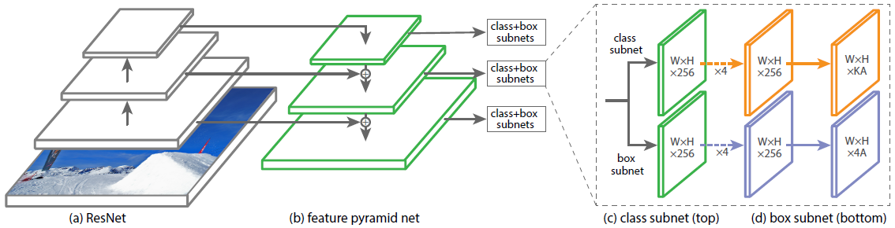

class: center, middle

# Convolutional Neural Networks for Object Detection

Olivier Grisel

`olivier.grisel@inria.fr`

Adapted from [Charles Ollion and Olivier Grisel](https://github.com/m2dsupsdlclass/lectures-labs)

---
# CNNs for computer Vision

.center[
          
]

---
# Beyond Image Classification

### CNNs
- Previous lecture: image classification

--

### Limitations
- Mostly on centered images
- Only a single object per image
- Not enough for many real world vision tasks

---
# Beyond Image Classification

.center[
           
          
]

---
# Beyond Image Classification

.center[
           
          
]
---
# Beyond Image Classification

.center[
           
          
]
---
# Beyond Image Classification

.center[
           
          
]
---
# Beyond Image Classification

.center[
           
          
]
---
# Outline

### Feature Maps and Fully convolutional Networks

--

### Simple Localization as regression

--

### Detection Algorithms

--

*next time*:

### Semantic & Instance Segmentation

---
class: middle, center

# Feature Maps and Fully Convolutional Networks

---
# Convolutionization of a Classification Network

.center[
  
]

.footnote.small[
Long, Jonathan, et al. "Fully convolutional networks for semantic segmentation." CVPR 2015
]

- Slide the network with an input of `(224, 224)` over a larger image. Output of varying spatial size
--

- **Convolutionize**: 

   - remove global average pooling and flattening layers
   - replace `Linear(2048, 1000)` to $1 \times 1$ `Conv2d(2048, 1000, kernel_size=1)`

???
output map upscaled from fully convolutional network

---
class: middle, center

# Localization

---
# Localization

.center[
          
]

--

- Single object per image
- Predict coordinates of a bounding box `(x, y, w, h)`

--
- Evaluate via Interection over Union (IoU)

---
# Localization as regression

.center[
          
]

---
# Localization as regression

.center[
          
]

---
# Classification + Localization

.center[
          
]

---
# Classification + Localization

.center[
          
]

--

- Use a pre-trained CNN on ImageNet (ex. ResNet)
- The "Localization head" is trained seperately with regression

--
- Possible end-to-end finetuning of both tasks

--
- At test time, use both heads

---
# Classification + Localization

.center[
          
]

$C$ classes, $4$ output dimensions ($1$ box)

--

**Predict exactly $N$ objects:** predict $(N \times 4)$ coordinates and $(N \times K)$ class scores

---
#Object detection

We don't know in advance the number of objects in the image. Object detection relies on *object proposal* and *object classification*

**Object proposal:** find regions of interest (RoIs) in the image

--

**Object classification:** classify the object in these regions

--

### Two main families:

- Single-Stage: A grid in the image where each cell is a proposal (SSD, YOLO, RetinaNet)
- Two-Stage: Region proposal then classification (Faster-RCNN)

---
# YOLO
.center[
          
]

.footnote.small[
Redmon, Joseph, et al. "You only look once: Unified, real-time object detection." CVPR (2016)
]

--

For each cell of the $S \times S$ predict:
- $B$ **boxes** and **confidence scores** $C$ ($5 \times B$ values) + **classes** $c$

---
# YOLO
.center[
          
]

For each cell of the $S \times S$ predict:
- $B$ **boxes** and **confidence scores** $C$ ($5 \times B$ values) + **classes** $c$

.footnote.small[
Redmon, Joseph, et al. "You only look once: Unified, real-time object detection." CVPR (2016)
]
---
# YOLO
.center[
          
]

Final detections: $C_j * prob(c) > \text{threshold}$

.footnote.small[
Redmon, Joseph, et al. "You only look once: Unified, real-time object detection." CVPR (2016)
]

---
# YOLO

.footnote.small[
Redmon, Joseph, et al. "You only look once: Unified, real-time object detection." CVPR (2016)
]

- After ImageNet pretraining, the whole network is trained end-to-end

--
- The loss is a weighted sum of different regressions

.center[
          
]

---
# RetinaNet

.center[
          
]

.footnote.small[
Lin, Tsung-Yi, et al. "Focal loss for dense object detection." ICCV 2017.
]

--

Single stage detector with:
- Multiple scales through a *Feature Pyramid Network*
- Focal loss to manage imbalance between background and real objects

--

See this [post](https://towardsdatascience.com/review-retinanet-focal-loss-object-detection-38fba6afabe4) for more information

---
# Box proposals

Instead of having a predefined set of box proposals, find them on the image:

**Region Proposal Network**

- Inputs:
  - coarse convolutional feature map
  - number $N$ of regions of interest
- Output: tensor of $N$ box coordinates and objectness scores at each location in the feature map

--

**Crop-and-resize** the feature map to feed positively classified boxes to a classification network
- Using a dedicated "RoI pooling" / "RoI align" layer
- Allows to propagate gradient only on interesting regions

---
# Faster-RCNN

.center[
          
]

.footnote.small[
Ren, Shaoqing, et al. "Faster r-cnn: Towards real-time object detection with region proposal networks." NIPS 2015
]

--

- Train jointly **RPN** and the classification head

--
- 200 box proposals, gradient propagated only in positive boxes

???
Region proposal input is a fully convolutional network: shares weights across spatial dimensions

---
## Measuring performance

.center[
          
]

Measures: mean Average Precision **mAP** at given **IoU** thresholds

- Average Precision: area under the Precision-Recall curve for one class and on IoU threshold.

.footnote.small[
Zeming Li et al. Light-Head R-CNN: In Defense of Two-Stage Object Detector 2017
]

--

- AP @0.5 for class "cat": average precision for the class, where $IoU(box^{pred}, box^{true}) > 0.5$

--

- mAP: average AP values for all classes.

---
## State-of-the-art

- Larger image sizes, larger and better models
- New architectures: transformers with DETR/DINO losses, deformable convolutions...
- Better augmented data, unsupervised pretraining
- Dataset curation
- https://paperswithcode.com/sota/object-detection-on-coco
