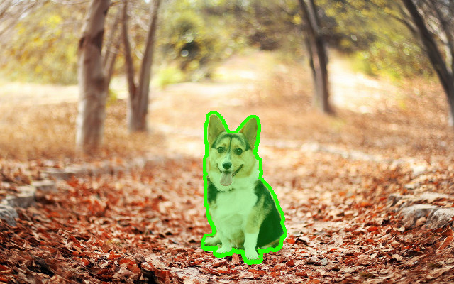
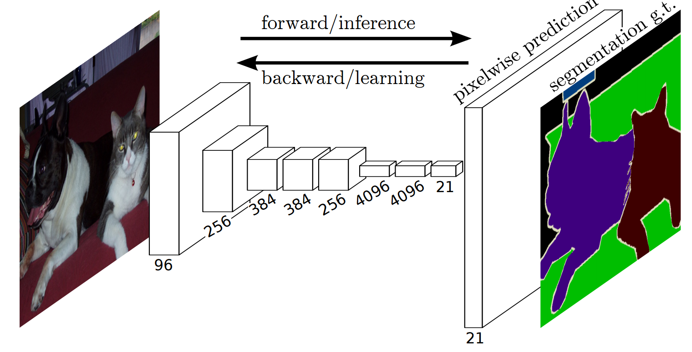
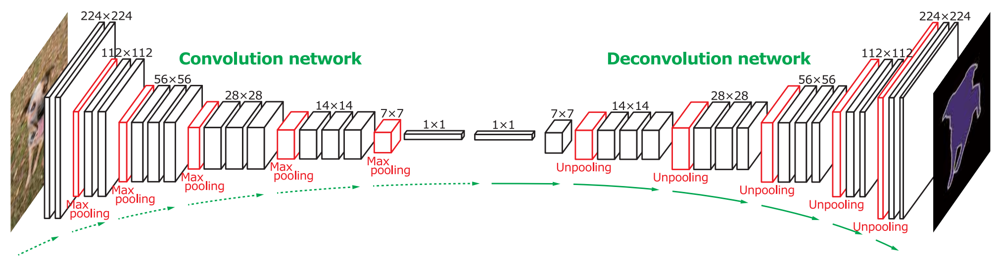
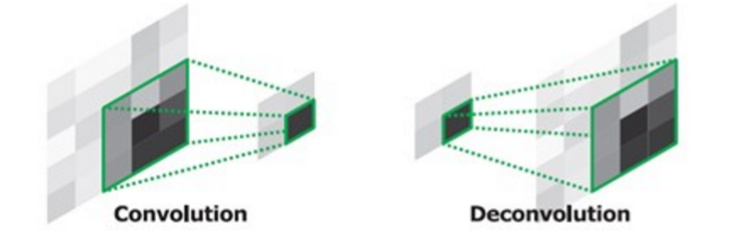
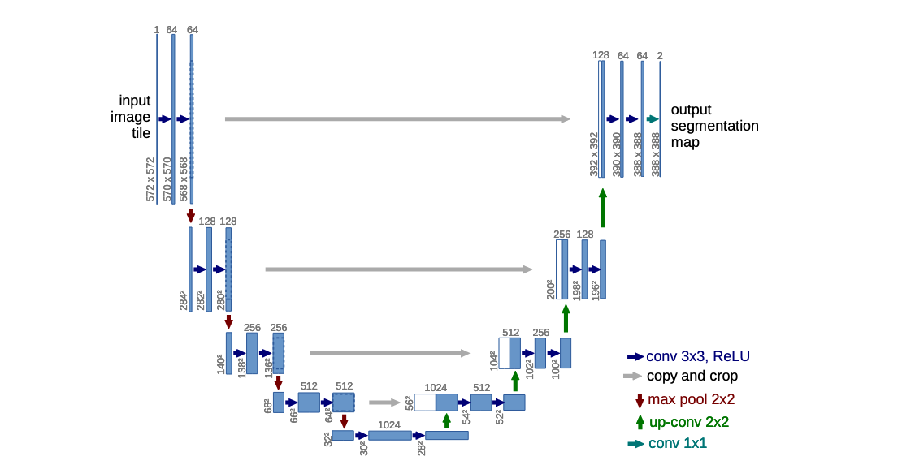
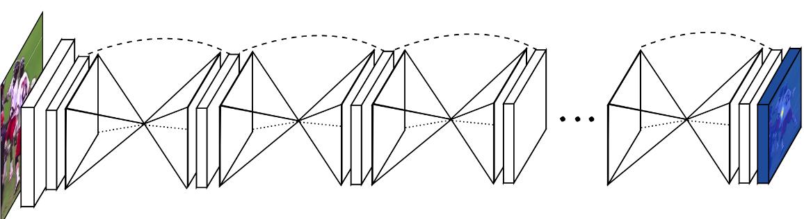
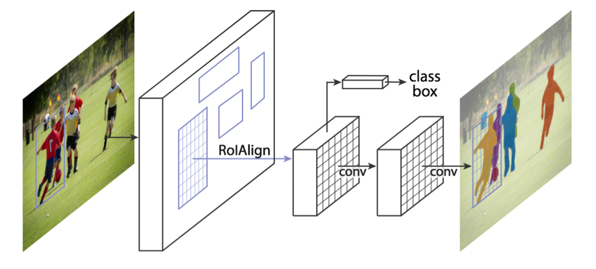
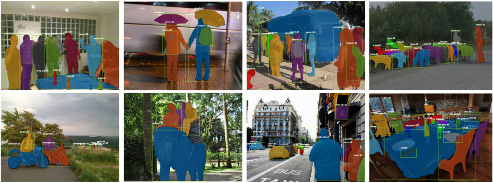
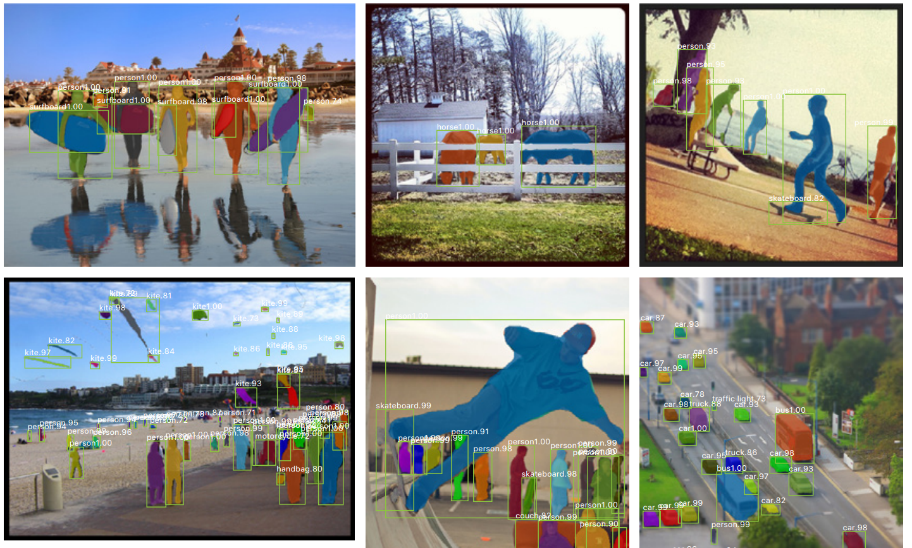

class: center, middle

# Convolutional for Semantic and Object Segmentation

Olivier Grisel

`olivier.grisel@inria.fr`

Adapted from [Charles Ollion and Olivier Grisel](https://github.com/m2dsupsdlclass/lectures-labs)

---
# Segmentation

Output a class map for each pixel (here: dog vs background)

.center[
          
]

--

- **Semantic segmentation**: full image, pixel-wise classification

--

  - No object detection

--

- **Instance segmentation**: specify each object instance as well (two dogs have different instances)

--
  - This can be done through **object detection** + **segmentation**

---
# Fully Convolutional Network

.center[
          
]

.footnote.small[
Long, Jonathan, et al. "Fully convolutional networks for semantic segmentation." CVPR 2015
]

--

- Predict / backpropagate for every output pixel

--
- Aggregate maps from several convolutions at different scales for more robust results

---
# Segmentation with Deconvolutions

.center[
          
]

.footnote.small[
Noh, Hyeonwoo, et al. "Learning deconvolution network for semantic segmentation." ICCV 2015
]

--

- "Deconvolution": transposed convolutions

.center[
          
]

--
- **sharper masks** by using precise spatial information (early layers)

--
- **better object 'understanding'** by using global information (middle layers)

???
Unpooling: switch variables tied to corresponding pooling layers. Remembers which pixel was the max

---
# Image Segmentation with U-Nets

.center[
          
]

.footnote.small[
Ronneberger, Olaf et al., "U-Net: Convolutional Networks for Biomedical Image Segmentation", MICCAI 2015
]

--
- **Skip connections** between corresponding convolution and deconvolution layers

---
# Hourglass network

.center[
          
]

.footnote.small[
Newell, Alejandro, et al. "Stacked Hourglass Networks for Human Pose Estimation." ECCV 2016
]

--
- U-Net like architectures repeated sequentially
--

- Each block refines the segmentation for the following
- Each block has a segmentation loss

---
## Mask-RCNN

.center[
          
]

.footnote.small[
K. He and al. Mask Region-based Convolutional Network (Mask R-CNN) NIPS 2017
]

--

Faster-RCNN architecture with a third, binary mask head
---
# Results

.center[
          
]

.footnote.small[
K. He and al. Mask Region-based Convolutional Network (Mask R-CNN) NIPS 2017
]

--

- Mask results are still coarse (low mask resolution)
- Excellent instance generalization

---
## Results

.center[
          
]

.footnote.small[
He, Kaiming, et al. "Mask r-cnn." Internal Conference on Computer Vision (ICCV), 2017.
]
---
## State-of-the-art & links

Most benchmarks and recent architectures are reported here:

.center[
https://paperswithcode.com/area/computer-vision
]

--

 

### Tensorflow

[object detection API](https://github.com/tensorflow/models/tree/master/research/object_detection)

--

### Pytorch

Detectron https://github.com/facebookresearch/Detectron

- Mask-RCNN, Retina Net and other architectures
- Focal loss, Feature Pyramid Networks, etc.

---
## Take away NN for Vision

### Pre-trained features as a basis

- ImageNet: centered objects, very broad image domain
- 1M+ labels and many different classes resulting in very **general** and **disentangling** representations
- Better Networks (i.e. ResNet vs VGG) have **a huge impact**
- Recent alternatives: self-supervised learning (more on this later)

--

### Transfer learning and fine tuning

Goal: make use of a smaller dataset but with richer labels:

- object bounding boxes, object classes, instance masks...

--

Steps:

- Remove the last layer(s) of a model pretrained on ImageNet (for instance)
- Add new layers that match the output shape of the new labels
- **Transfer learning**: fit only the last layers to the new dataset
- or **Fine tune** the whole architecture end-to-end
