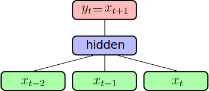
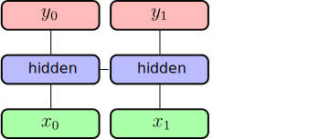

class:middle, center
# Language Modelling and Recurrent Neural Networks 
Natural Language Processing with Deep Learning

Charles Ollion - Olivier Grisel

Source material:

https://m2dsupsdlclass.github.io/lectures-labs/slides/06_deep_nlp/index.html

---
## Language Models

Assign a probability to a sequence of words, such that plausible sequences have
higher probabilities e.g:

- $p(\text{"I like cats"}) > p(\text{"I table cats"})$
- $p(\text{"I like cats"}) > p(\text{"like I cats"})$

--

**Auto-regressive sequence modelling**

$p\_{\theta}(w\_{0})$

$p_{\theta}$ is parametrized by a neural network.
---
## Language Models

Assign a probability to a sequence of words, such that plausible sequences have
higher probabilities e.g:

- $p(\text{"I like cats"}) > p(\text{"I table cats"})$
- $p(\text{"I like cats"}) > p(\text{"like I cats"})$

**Auto-regressive sequence modelling**

$p\_{\theta}(w\_{0}) \cdot p\_{\theta}(w\_{1} | w\_{0})$

$p_{\theta}$ is parametrized by a neural network.
---
## Language Models

Assign a probability to a sequence of words, such that plausible sequences have
higher probabilities e.g:

- $p(\text{"I like cats"}) > p(\text{"I table cats"})$
- $p(\text{"I like cats"}) > p(\text{"like I cats"})$

**Auto-regressive sequence modelling**

$p\_{\theta}(w\_{0}) \cdot p\_{\theta}(w\_{1} | w\_{0}) \cdot \ldots \cdot p\_{\theta}(w\_n | w\_{n-1}, w\_{n-2}, \ldots, w\_0)$

$p_{\theta}$ is parametrized by a neural network.

--

The internal representation of the model can better capture the meaning
of a sequence than a simple Bag-of-Words.

---
## Conditional Language Models

NLP problems expressed as **Conditional Language Models**:

**Translation:** $p(Target | Source)$
- *Source*: "J'aime les chats"
- *Target*: "I like cats"

--

Model the output word by word:

$p\_{\theta}(w\_{0} | Source)$

---
## Conditional Language Models

NLP problems expressed as **Conditional Language Models**:

**Translation:** $p(Target | Source)$
- *Source*: "J'aime les chats"
- *Target*: "I like cats"

Model the output word by word:

$p\_{\theta}(w\_{0} | Source) \cdot p\_{\theta}(w\_{1} | w\_{0}, Source) \cdot \ldots $

---
## Conditional Language Models

**Question Answering / Dialogue:**

$p( Answer | Question , Context )$

- *Context*:
  - "John puts two glasses on the table."
  - "Bob adds two more glasses."
  - "Bob leaves the kitchen to play baseball in the garden."
- *Question*: "How many glasses are there?"
- *Answer*: "There are four glasses."

--

**Image Captionning:** $p( Caption | Image )$

- Image is usually the $2048$-d representation from a CNN

???

Question: do you have any idea of those NLP tasks that could be tackled
with a similar conditional modeling approach?

---
## Simple Language Model

.center[

]

--

Fixed context size

- **Average embeddings**: (same as CBoW) no sequence information

--
- **Concatenate embeddings**: introduces many parameters

--
- **1D convolution**: larger contexts and limit number of parameters

--
- Still does not take well into account varying sequence sizes and sequence dependencies
???
Question: What's the dimension of concatenate embeddings?
---
## Recurrent Neural Network

.center[

]

--

Unroll over a sequence $(x_0, x_1, x_2)$:

.center[

]
---
## Recurrent Neural Network

.center[

]

Unroll over a sequence $(x_0, x_1, x_2)$:

.center[

]
---
## Recurrent Neural Network

.center[

]

Unroll over a sequence $(x_0, x_1, x_2)$:

.center[

]

---
## Language Modelling

.center[

]

**input** $(w\_0, w\_1, ..., w\_t)$ .small[ sequence of words ( 1-hot encoded ) ]  
**output** $(w\_1, w\_2, ..., w\_{t+1})$ .small[shifted sequence of words ( 1-hot encoded ) ]

---
## Language Modelling

.center[

]

$x\_t = \text{Emb}(w\_t) = \mathbf{E} w\_t$ .right[input projection .red[`H`]]

--

$h\_t = g(\mathbf{W^h} h\_{t-1} + x\_t + b^h)$ .right[recurrent connection .red[`H`]]

--

$y = \text{softmax}( \mathbf{W^o} h\_t + b^o )$ .right[output projection .red[`K = |V|`]]

---
## Recurrent Neural Network

.center[

]

Input embedding $\mathbf{E}$  .right[.red[`|V| x H`]]

--

Recurrent weights $\mathbf{W^h}$  .right[.red[`H x H`]]

--

Output weights $\mathbf{W^{out}}$ .right[ .red[`H x K = H x |V|`]]

---
## Backpropagation through time

Similar as standard backpropagation on unrolled network

.center[

]

---
## Backpropagation through time

Similar as standard backpropagation on unrolled network

.center[

]

---
## Backpropagation through time

Similar as standard backpropagation on unrolled network

.center[

]

 

--

- Similar as training **very deep networks** with tied parameters
- Example between $x_0$ and $y_2$: $W^h$ is used twice

--
- Usually truncate the backprop after $T$ timesteps

--
- Difficulties to train long-term dependencies

---
## Other uses: Sentiment Analysis

.center[

]

- Output is sentiment (1 for positive, 0 for negative)

--
- Very dependent on words order

--
- Very flexible network architectures
---
## Other uses: Sentiment analysis

.center[

]

- Output is sentiment (1 for positive, 0 for negative)
- Very dependent on words order
- Very flexible network architectures

---
# LSTM
.center[

]

.footnote.small[
Hochreiter, Sepp, and Jürgen Schmidhuber. "Long short-term memory." Neural computation 1997
]

---
# LSTM
.center[

]

.footnote.small[
Hochreiter, Sepp, and Jürgen Schmidhuber. "Long short-term memory." Neural computation 1997
]

---
# LSTM
.center[

]

.footnote.small[
Hochreiter, Sepp, and Jürgen Schmidhuber. "Long short-term memory." Neural computation 1997
]

--
- 4 times more parameters than RNN

--
- Mitigates **vanishing gradient** problem through **gating**

--
- Widely used and SOTA in many sequence learning problems

---
.footnote.small[
Hochreiter, Sepp, and Jürgen Schmidhuber. "Long short-term memory." Neural computation 1997
]

$\mathbf{ u} = \sigma(\mathbf{W^u} \cdot h\_{t-1} + \mathbf{I^u} \cdot x\_t + b^u)$ .right[Update gate .red[`H`]]

--

$\mathbf{ f} = \sigma(\mathbf{W^f} \cdot h\_{t-1} + \mathbf{I^f} \cdot x\_t + b^f)$ .right[Forget gate .red[`H`]]

--

$\mathbf{ \tilde{c\_t}} = \tanh(\mathbf{W^c} \cdot h\_{t-1} + \mathbf{I^c} \cdot x\_t + b^c)$ .right[Cell candidate .red[`H`]]

--

$\mathbf{ c\_t} = \mathbf{f} \odot \mathbf{c\_{t-1}} + \mathbf{u} \odot \mathbf{ \tilde{c\_t}}$ .right[Cell output .red[`H`]]

--

$\mathbf{ o} = \sigma(\mathbf{W^o} \cdot h\_{t-1} + \mathbf{I^o} \cdot x\_t + b^o)$ .right[Output gate .red[`H`]]

--

$\mathbf{ h\_t} = \mathbf{o} \odot \tanh(\mathbf{c\_t})$ .right[Hidden output .red[`H`]]

--

$y = \text{softmax}( \mathbf{W} \cdot h\_t + b )$ .right[Output .red[`K`]]

--
 

$W^u, W^f, W^c, W^o$ .right[Recurrent weights .red[`H x H`]]

$I^u, I^f, I^c, I^o$ .right[Input weights .red[`N x H`]]

---
# GRU

Gated Recurrent Unit: similar idea as LSTM

.footnote.small[
Chung, Junyoung, et al. "Gated Feedback Recurrent Neural Networks." ICML 2015
]

- less parameters, as there is one gate less
- no "cell", only hidden vector $h_t$ is passed to next unit

--

In practice

- more recent, people tend to use LSTM more
- no systematic difference between the two

---
## Vanishing / Exploding Gradients

Passing through $t$ time-steps, the resulting gradient is the **product** of many gradients and activations.

--
- Gradient messages close to $0$ can shrink be $0$
- Gradient messages larger than $1$ can explode

--
- **LSTM / GRU** mitigate that in RNNs
- **Additive path** between $c\_t$ and $c\_{t-1}$

--
- **Gradient clipping** prevents gradient explosion
- Well chosen **activation function** is critical (tanh)

--

**Skip connections** in ResNet also alleviate a similar optimization problem.

