class: center, middle

# Sequences, Attention and Transformers

Olivier Grisel

`olivier.grisel@inria.fr`

Adapted from [Charles Ollion and Olivier Grisel](https://github.com/m2dsupsdlclass/lectures-labs)

---
## Reminder: Recurrent Neural Networks

.center[
          
]

--

Takes a sequence as inputs.

May output a single value, or a value for each time-step of the input.

Enough for auto-regressive language modelling via next word prediction.

Nowadays, often called a decoder-only architecture in the context of language models.

---

## Outline

### Encoder-decoder for machine translation

--

### Attention mechanisms

--

### Self-attention and Transformers

---
class: center,middle

# Encoder-Decoder for machine translation

From sequence to sequence

---
## Decoder-only Seq2Seq

.center[
          
]

.footnote.small[
Sutskever, Ilya, Oriol Vinyals, and Quoc V. Le. "Sequence to sequence learning with neural networks." NIPS 2014
]

---
## Decoder-only Seq2Seq

.center[
          
]

- Trained via **Teacher Forcing**:
  - Feed the ground-truth translation as input at each time-step
  - The model is trained to predict the next word in the target sequence

--
- **Reverse order** of the source sequence

--
- Special symbols for starting decoding and end of sentence

---
## Encoder-Decoder Seq2Seq

.center[
          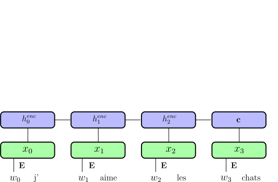
]

.footnote.small[
Cho, Kyunghyun, et al. "Learning phrase representations using RNN encoder-decoder for statistical machine translation." 2014
]
---
## Encoder-Decoder Seq2Seq

.center[
          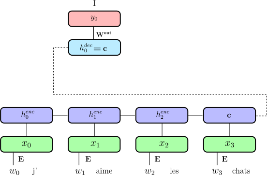
]

.footnote.small[
Cho, Kyunghyun, et al. "Learning phrase representations using RNN encoder-decoder for statistical machine translation." 2014
]
---
## Encoder-Decoder Seq2Seq

.center[
          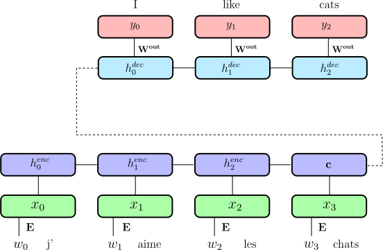
]

.footnote.small[
Cho, Kyunghyun, et al. "Learning phrase representations using RNN encoder-decoder for statistical machine translation." 2014
]
---
## Encoder-Decoder Seq2Seq

.center[
          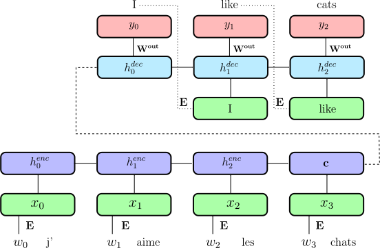
]

.footnote.small[
Cho, Kyunghyun, et al. "Learning phrase representations using RNN encoder-decoder for statistical machine translation." 2014
]

---
## Large Vocabulary Size

**Softmax** computation becomes **intractable** both at training and
inference time (sum over $|V|$).

--

**Negative Sampling** works well to learn word embeddings but is **not a
good approximation** for **language modeling** and machine translation.

--

Approximate softmax with **sampled softmax** (a.k.a. bucketing) but not great either.

--

Ideally we would like a smaller vocabulary space (50k instead of 1M+) and
stick to exact softmax normalization.

---
## Alternatives to word-level tokenization

### Character-level or byte-level tokenization

- 👍 Much smaller vocabulary size (faster softmax)
- 👍 No need for language specific segmentation (e.g. Chinese);
- 👍 Robust to spelling mistakes and out-of-vocabulary words;
- 👍 Handle with mixed language data.

--
- 👎 Model needs to learn word structure from data;
- 👎 Decoding more complex and expensive.

--

### Subword tokenization

- Agreggate frequently occuring characters into a single token.
- **Byte Pair Encoding** (BPE) and variants.
- Implementation: https://huggingface.co/docs/tokenizers/
- Typical vocabulary size: 30,000 to 50,000.
- Most popular approach for today's Large Language Models (LLMs).

???

BPE (https://arxiv.org/abs/1508.07909):

- Start with a vocabulary of characters (encoded as bytes);
- Scan training set to compute most frequent char bigrams and replace
  them with a new single byte symbol;
- Recurse until target vocabulary size is reached (hyper-parameter).

---
class: center,middle

# Attention Mechanism

---
# Attention Mechanism

Main problem with Encoder-Decoder:
- A sentence may have different parts with different concepts
- The **whole sentence** is represented as a **single vector**

.center[
*I like cats but I don't like dogs*
]

.footnote.small[
In depth explanation on https://blog.heuritech.com/2016/01/20/attention-mechanism/
]
--

  
 Solution:

- Use all outputs of the encoder $\{h_i\}$ to compute the outputs
- Build an **Attention Mechanism** to determine which output(s) to attend to

---
# Attention Mechanism

.center[
          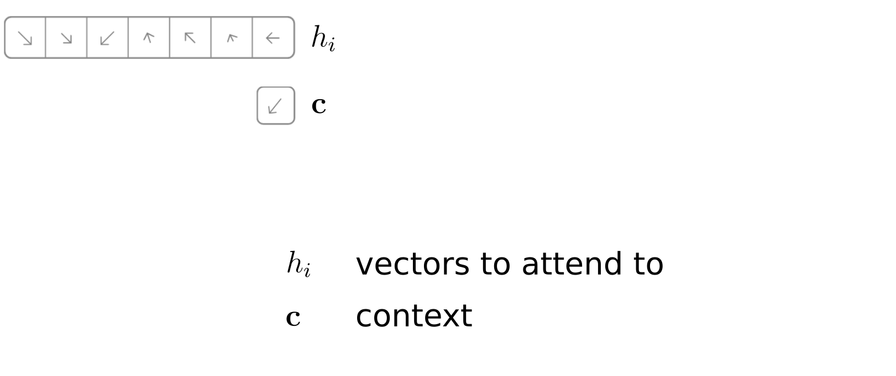
]

- Goal : select most relevant vector(s) given context $\mathbf{c}$

---
# Attention Mechanism

.center[
          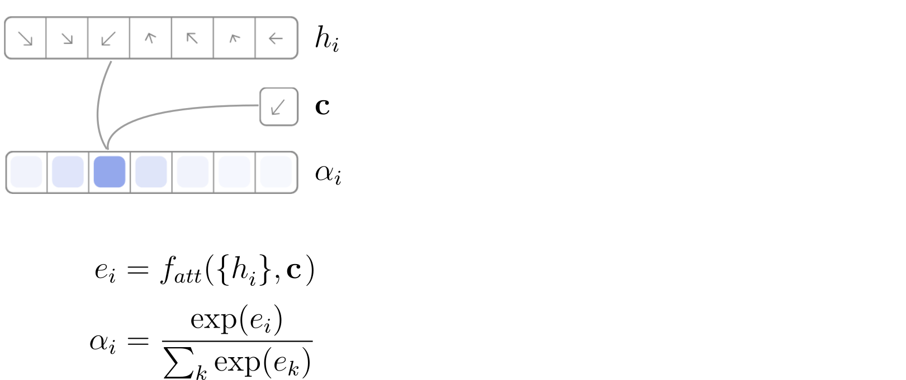
]

--

  

- $f_{att}$ may be a cosine similarity, a deep network, etc.
- softmax enables to normalize and focus on very few items

---
# Attention Mechanism

.center[
          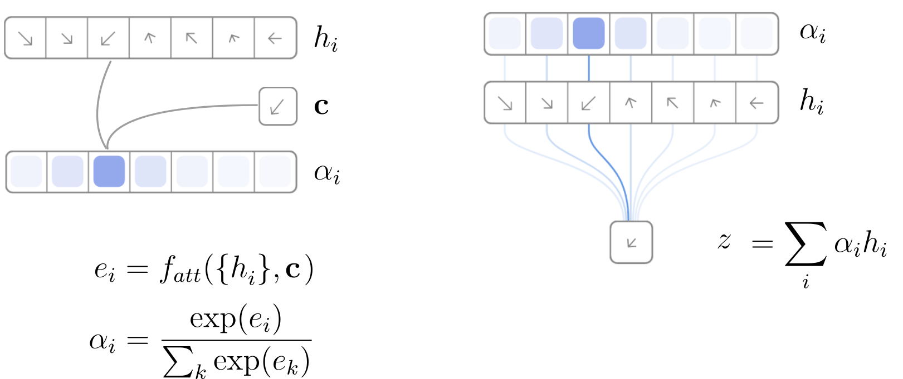
]

--

Compute a soft (differentiable) selection on a set of vectors

---
# Attention Mechanism

.center[
          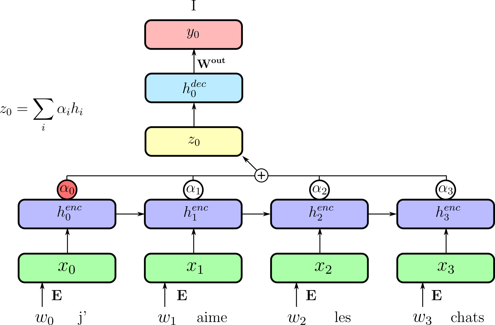
]

.footnote.small[
Neural machine translation by jointly learning to align and translate, D Bahdanau, K Cho, Y Bengio 2014
]
---
# Attention Mechanism

.center[
          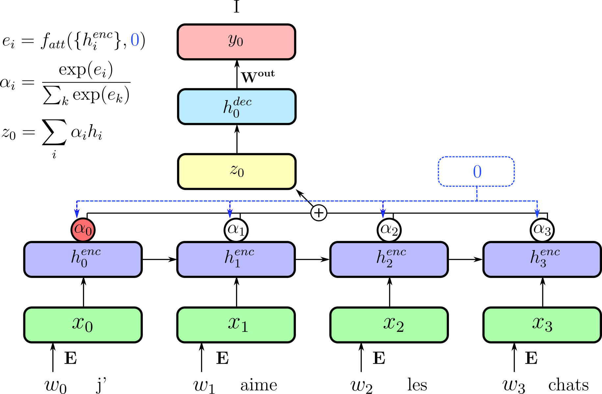
]

.footnote.small[
Neural machine translation by jointly learning to align and translate, D Bahdanau, K Cho, Y Bengio 2014
]
---
# Attention Mechanism

.center[
          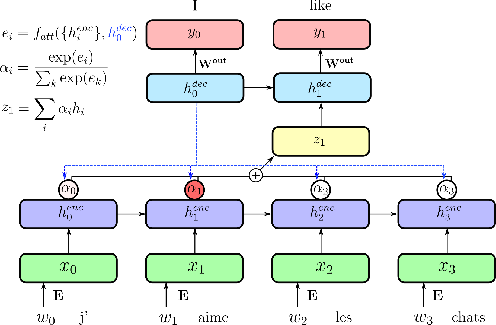
]

.footnote.small[
Neural machine translation by jointly learning to align and translate, D Bahdanau, K Cho, Y Bengio 2014
]
---
# Attention Mechanism

.center[
          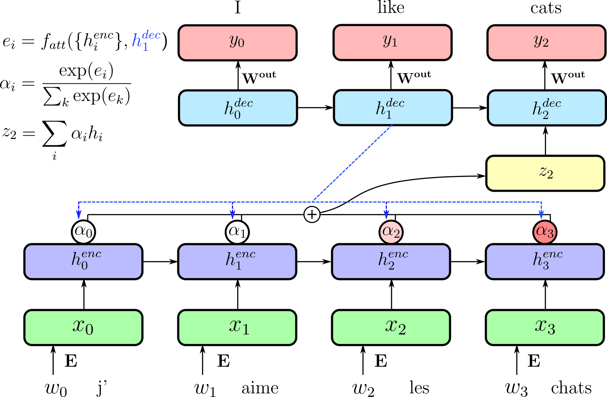
]

.footnote.small[
Neural machine translation by jointly learning to align and translate, D Bahdanau, K Cho, Y Bengio 2014
]
---
# Visualizing Attention

.center[
          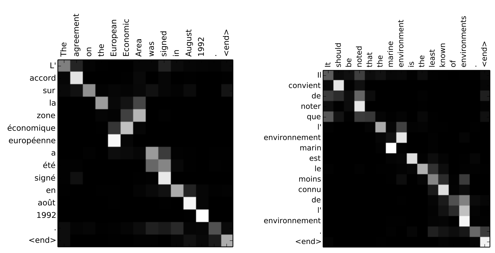
]

.footnote.small[
Neural machine translation by jointly learning to align and translate, D Bahdanau, K Cho, Y Bengio 2014
]
---
# The GNMT architecture (2016)

.center[
          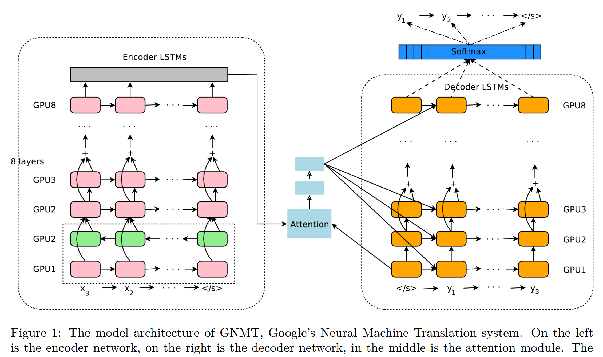
]

.footnote.small[
Yonghui Wu et al. "Google's Neural Machine Translation System: Bridging
the Gap between Human and Machine Translation"
]

???
- bi LSTM
- stack LSTM GPU
- reLU
- inference TPU

---

# Image Captioning

.center[
          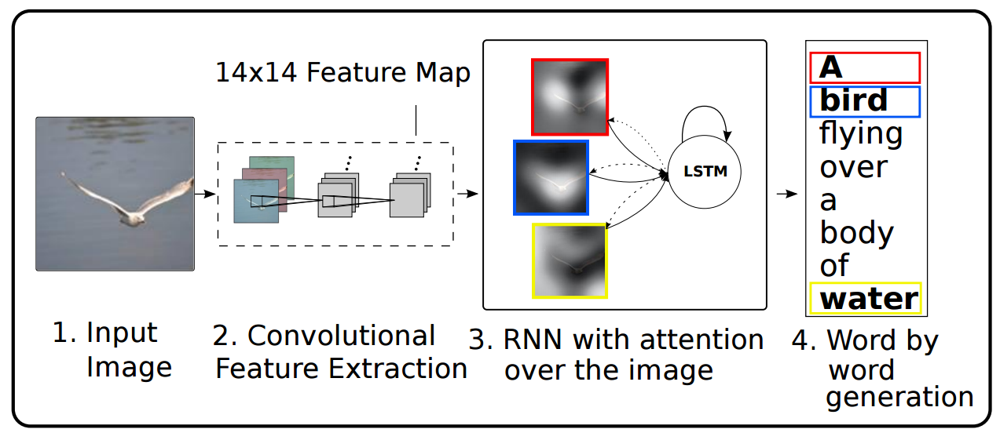
]

.footnote.small[
Xu, Kelvin, et al. "Show, Attend and Tell: Neural Image Caption Generation with Visual Attention." ICML. 2015
]

--

.center[
          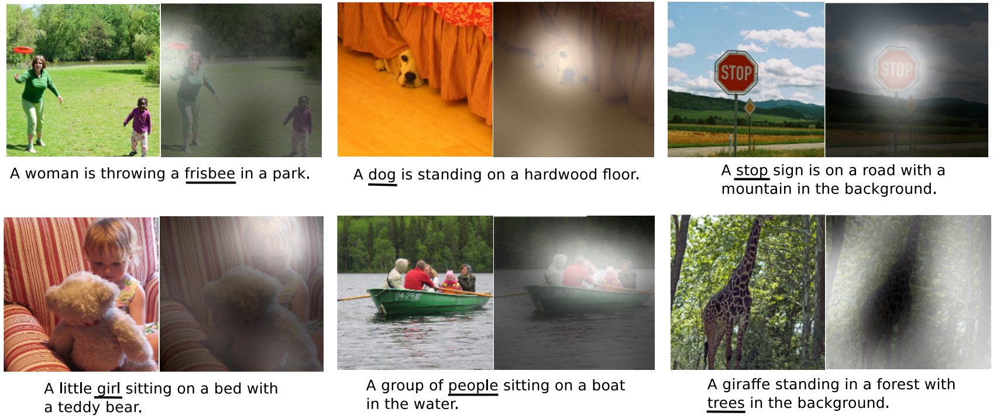
]
---
class: center, middle

# Self-attention and transformers
---

# Self-Attention

For each element of an input sequence ${X_i}$ project into 3 vectors: query, key and value

.center[
          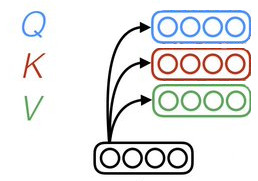
]

.footnote.small[
Attention Is All You Need Ashish Vaswani et al. NIPS 2017
]

--

For each element, compute attention over all other vectors

$$SelfAttention(Q_i, \mathbf{K}, \mathbf{V}) = \sum_j softmax_j(\frac{Q_i \cdot \mathbf{K}^T}{\sqrt{d_k}}) V_j $$

---

# Single-head self-attention

.center[
          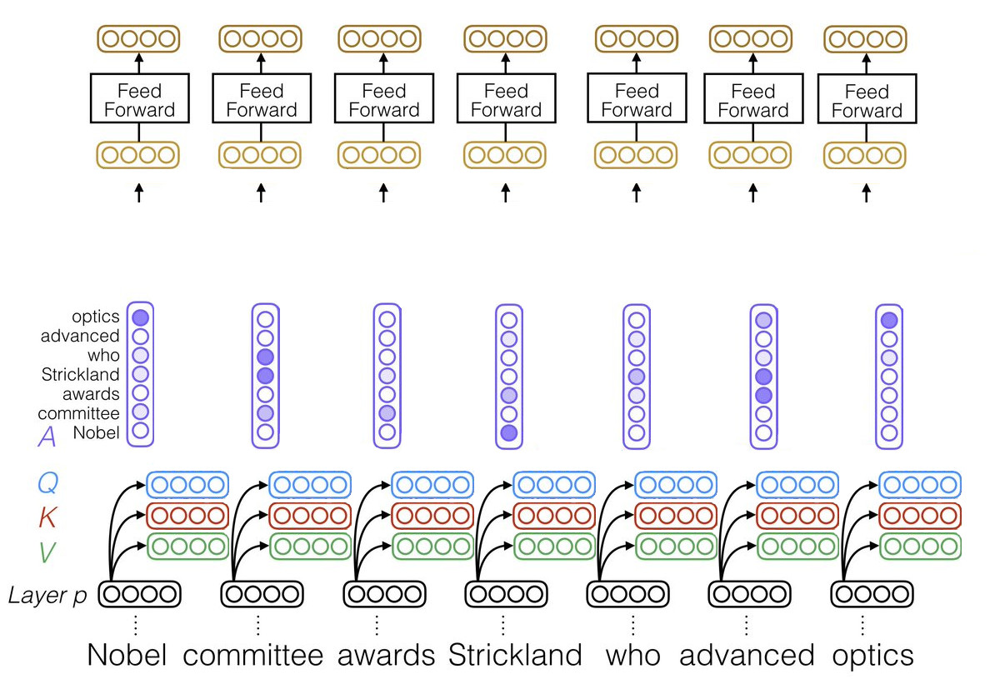
]

.footnote.small[
Adapted from Emma Strubell EMNLP 2018
]

---

# Multi-head self-attention

.center[
          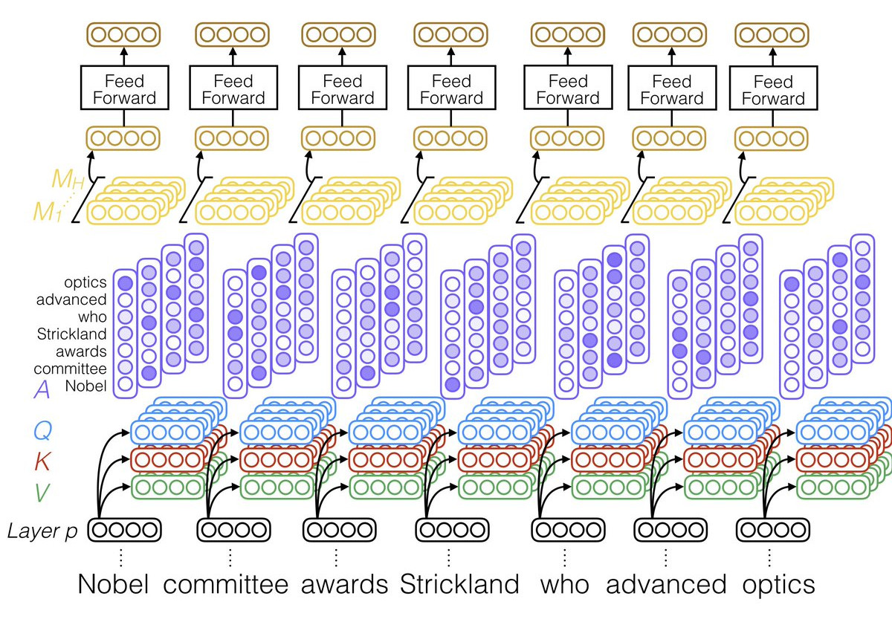
]

.footnote.small[
Adapted from Emma Strubell EMNLP 2018
]
---
### Transformer Architecture

.center[
          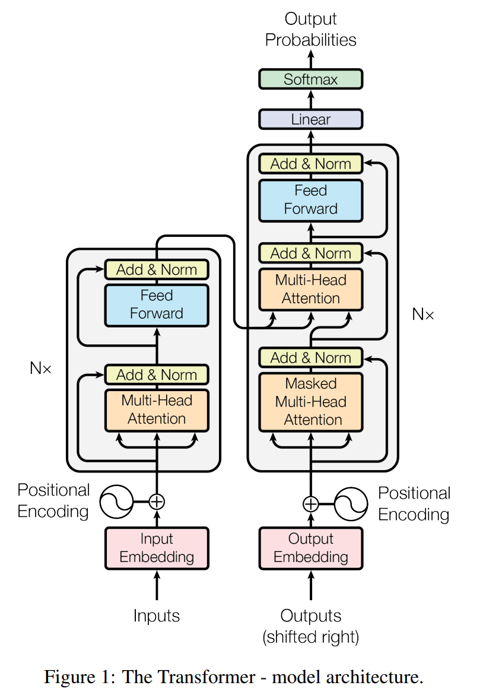
]

.footnote.small[
Attention Is All You Need Ashish Vaswani et al. NIPS 2017
]
---

# Token positional encoding

No notion of token order. Positional encoding need to be added:

.center[
  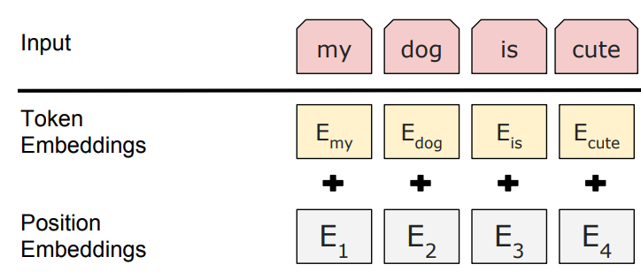
]

--

.center[
  
]

Alternative: learn the positional embedding parameters from random init.

---
# Pretraining transformers on text data

*Pretrained transformers* for transfer learning in NLP in 2018-2010, similar to
"ImageNet-pretrained convnets" in 2012-2014.

BERT:

- Masked auto-encoding pretraining
- Still used as encoder for text feature extraction models
- Not used for actual text generation.

GPT: Generative Pretrained Transformers

- Teacher forcing on next-token prediction tasks on a web-scale dataset.
- Decoder-only architecture

.footnote.small[
BERT : Pre-training of Deep Bidirectional Transformers for Language Understanding, Jacob Devlin et al. 2018  
GPT2 : https://openai.com/blog/better-language-models/
]

---

# BERT

.center[
          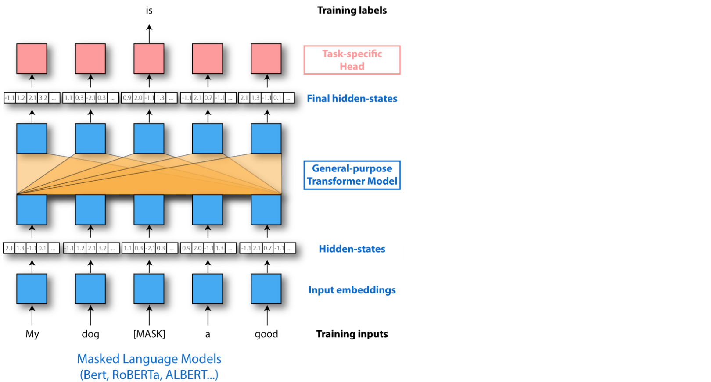
]

.footnote.small[
Slide from Thomas Wolf (HuggingFace)
]
---

# BERT vs GPT

.center[
          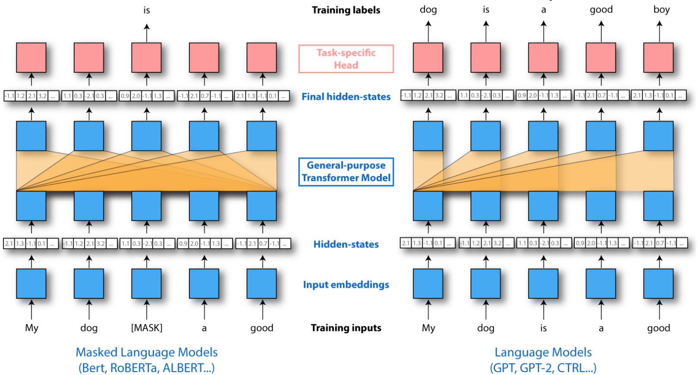
]

.footnote.small[
Slide from Thomas Wolf (HuggingFace)
]

---
# BERT

.center[
          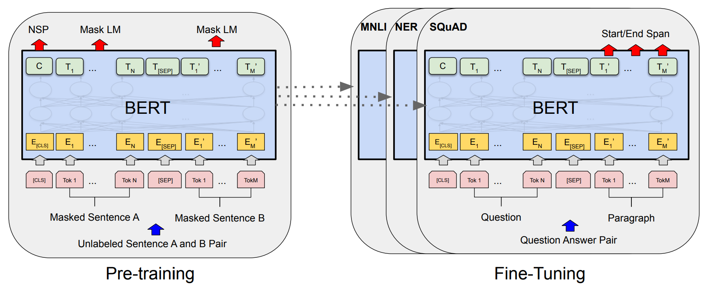
]

--

.center[
          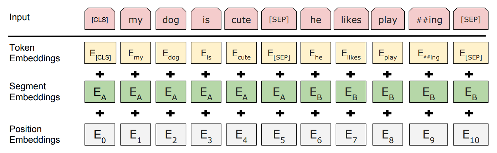
]

---
# SOTA LLMs

Open-source LLMs implementation and open weights:

- https://github.com/huggingface/transformers (open source library)
- https://huggingface.co/models (pretrained weights, various licenses)

Open LLMs evaluated on various benchmarks (GPQA, MMLU-Pro...):

- https://huggingface.co/spaces/open-llm-leaderboard/open_llm_leaderboard

Human evaluation of LLM-based chat systems (most not open):

- https://lmarena.ai

---
# Takeaways

- LMs can use either RNN or **Transformers** with *causal* attention in the decoder.

- Architecture variants:
  - Encoder-only: BERT and co
  - Decoder-only: GPT and most other recent LLMs
  - Encoder-decoder: Attention is all you need

- Pretraining:
  - Masked language modeling (BERT and derivatives)
  - Autogressive language modeling via **Teacher Forcing** (GPT and derivatives)

Modern LLMs: pretrained with hundreds of billions of tokens and parameters with
hundreds of high-end GPUs.

Further fine-tuned for chat/coding assistance/math reasoning/tool usage on
supervised data and via reinforcement learning.

