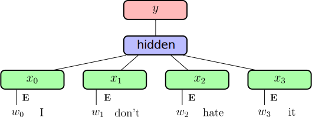
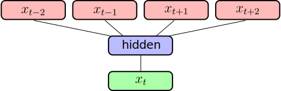

# Natural Language Processing with Word Embeddings

Olivier Grisel

`olivier.grisel@inria.fr`

Adapted from [Charles Ollion and Olivier Grisel](https://github.com/m2dsupsdlclass/lectures-labs)

---
## Natural Language Processing

- Fixed size outputs (traditional methods are still competitive)

  - Sentence or document level classification (supervised)

      - Topic, sentiment

--
  - Text clustering (unsupervised)

      - Group similar documents

--
  - Topic modeling (unsupervised)

      - One document can belong to several topics

--
- Same length output (neural networks work well)
  - Named entity extraction

      - Recognise names of places, organizations, people, phone numbers...

--
- Variable length output: generative models (neural networks required)

  - Machine translation

--
  - Document summarization

--
  - General purpose AI assistants (LLMs)

---
# Recommended reading

*A Primer on Neural Network Models for Natural Language Processing* by
Yoav Goldberg

.center[
http://u.cs.biu.ac.il/~yogo/nnlp.pdf
]

--

Useful open source projects

.center[

]

---
# Outline

 
*This session:*

### Classification and word representation

--

### Word2Vec

--

*Next sessions:*

### Language Modelling

--

### Recurrent neural networks

--

### Sequence to Sequence

--

### Attention mechanisms

--

### Transformers 

---
class: middle, center

# Word Representation and Word2Vec

---
# Word representation

Words are indexed and represented as 1-hot vectors

--

Large Vocabulary of possible words $|V|$

--

Use of **Embeddings** as inputs in all Deep NLP tasks

--

Word embeddings usually have dimensions 50, 100, 200, 300

---
# Supervised Text Classification

.center[

]

.footnote.small[
Joulin, Armand, et al. "Bag of tricks for efficient text classification." FAIR 2016
]

???
Question: shape of embeddings if hidden size is H

--

$\mathbf{E}$ embedding (linear projection) .right.red[`|V| x H`]

--

Embeddings are averaged .right[hidden activation size: .red[`H`]]

--

Dense output connection $\mathbf{W}, \mathbf{b}$ .right.red[`H x K`]

--

Softmax and **cross-entropy** loss

---
# Supervised Text Classification

.center[

]

.footnote.small[
Joulin, Armand, et al. "Bag of tricks for efficient text classification." FAIR 2016
]

 

- Very efficient (**speed** and **accuracy**) on large datasets

--
- State-of-the-art (or close to) on several classification, when adding **bigrams/trigrams**

--
- Little gains from depth

---
# Transfer Learning for Text

Similar to image: can we have word representations that are generic
enough to **transfer** from one task to another?

--

**Unsupervised / self-supervised** learning of word representations

--

**Unlabelled** text data is almost infinite:
  - Wikipedia dumps
  - Project Gutenberg
  - Social Networks
  - Common Crawl

---
# Word Vectors

.center[

]

.footnote.small[
excerpt from work by J. Turian on a model trained by R. Collobert et al. 2008
]

???
Question: what distance to use in such a space
---
# Word2Vec

.center[

]

.footnote.small[
Colobert et al. 2011, Mikolov, et al. 2013
]

--

 

### Compositionality

.center[

]

---
# Word Analogies

.center[

]

.footnote.small[
Mikolov, Tomas, et al. "Distributed representations of words and phrases and their compositionality." NIPS 2013
]

--

- Linear relations in Word2Vec embeddings

--
- Many come from text structure (e.g. Wikipedia)

---
# Self-supervised training

Distributional Hypothesis (Harris, 1954):
*“words are characterised by the company that they keep”*

Main idea: learning word embeddings by **predicting word contexts**

.footnote.small[
Mikolov, Tomas, et al. "Distributed representations of words and phrases and their compositionality." NIPS 2013
]

--

Given a word e.g. “carrot” and any other word $w \in V$ predict
probability $P(w|\text{carrot})$ that $w$ occurs in the context of
“carrot”.

--

- **Unsupervised / self-supervised**: no need for class labels.
- (Self-)supervision comes from **context**.
- Requires a lot of text data to cover rare words correctly.

???
How to train fastText like model on this?
---
# Word2Vec: CBoW

CBoW: representing the context as **Continuous Bag-of-Word**

Self-supervision from large unlabeled corpus of text: *slide* over an **anchor word** and its **context**:

.center[

]

.footnote.small[
Mikolov, Tomas, et al. "Distributed representations of words and phrases and their compositionality." NIPS 2013
]

---
# Word2Vec: CBoW

CBoW: representing the context as **Continuous Bag-of-Word**

Self-supervision from large unlabeled corpus of text: *slide* over an **anchor word** and its **context**:

.center[

]

.footnote.small[
Mikolov, Tomas, et al. "Distributed representations of words and phrases and their compositionality." NIPS 2013
]

???
Question: dim of output embedding vs dim of input embedding
---
# Word2Vec: Details

 

.center[

]

.footnote.small[
Mikolov, Tomas, et al. "Distributed representations of words and phrases and their compositionality." NIPS 2013
]

- Similar as supervised CBoW (e.g. fastText) with |V| classes

--
- Use **Negative Sampling**: sample *negative* words at random instead of computing the full softmax. See: <small> http://sebastianruder.com/word-embeddings-softmax/index.html</small>

--
- Large impact of **context size**

???

Softmax is too computationally intensive to be practical: the
normalization term involves a sum over the full vocabulary of
cardinality |V| >> 10000 at each gradient step.

Negative Sampling uses k=5 negative words sampled at random instead.
This is not accurate enough to estimate
`p(x_t|x_{t-2}, x_{t-1}, x_{t+1}, x_t{t+2})`
accuractely but it's a good enough approximation to train a
useful word embedding parameters.

---
# Word2Vec: Skip Gram
a
 

.center[

]

 

- Given the central word, predict occurence of other words in its context.

--
- Widely used in practice

--
- Again **Negative Sampling** is used as a cheaper alternative to full softmax.

---
# Evaluation and Related methods

Always difficult to evaluate unsupervised tasks

- WordSim (Finkelstein et al.)
- SimLex-999 (Hill et al.)
- Word Analogies (Mikolov et al.)

--

 

Other popular method: **GloVe** (Socher et al.) http://nlp.stanford.edu/projects/glove/

.footnote.small[
Pennington, Jeffrey, Richard Socher, and Christopher D. Manning. "Glove: Global Vectors for Word Representation." EMNLP. 2014
]
---
# Take Away on Embeddings

**For text applications, inputs of Neural Networks are Embeddings**

--

- If **little training data** and a wide vocabulary not well
  covered by training data, use **pre-trained self-supervised embeddings**
  (transfer learning from Glove, word2vec or fastText embeddings)

--
- If **large training data** with labels, directly learn
  task-specific embedding with methods such as **fastText in
  supervised mode**.

--
- These methods use **Bag-of-Words** (BoW): they **ignore the order** in
  word sequences

--
- Depth &amp; non-linear activations on hidden layers are not that useful for
  BoW text classification.

--

**Word Embeddings** no long state of the art for NLP tasks: BERT-style or
GPT-style pretraining of deep transformers with sub-word tokenization is now
used everywhere.

---
class: middle, center

# back here in 15 min!

