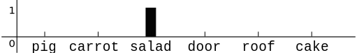
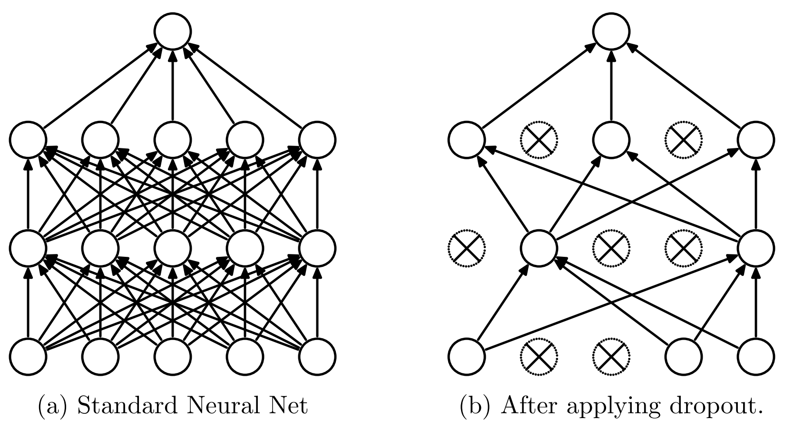
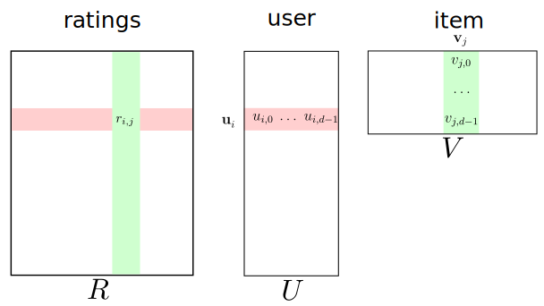
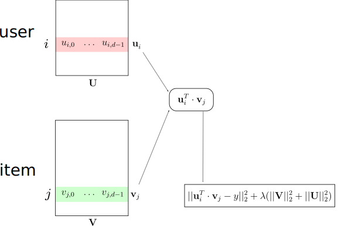
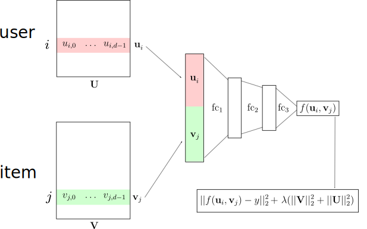
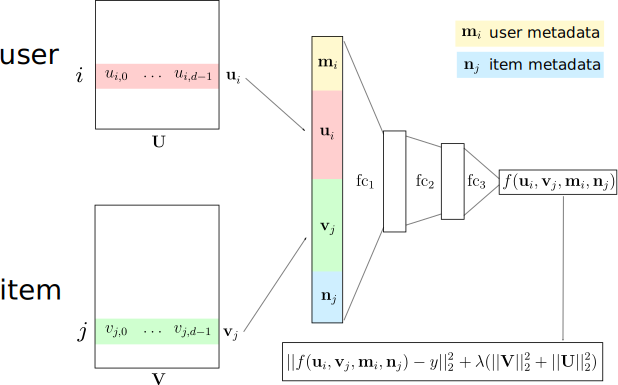
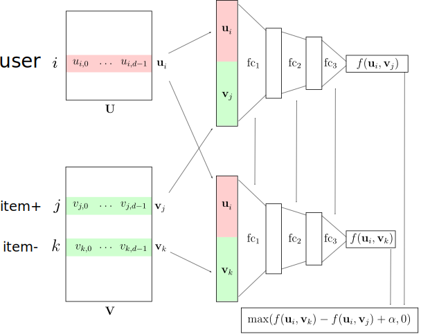
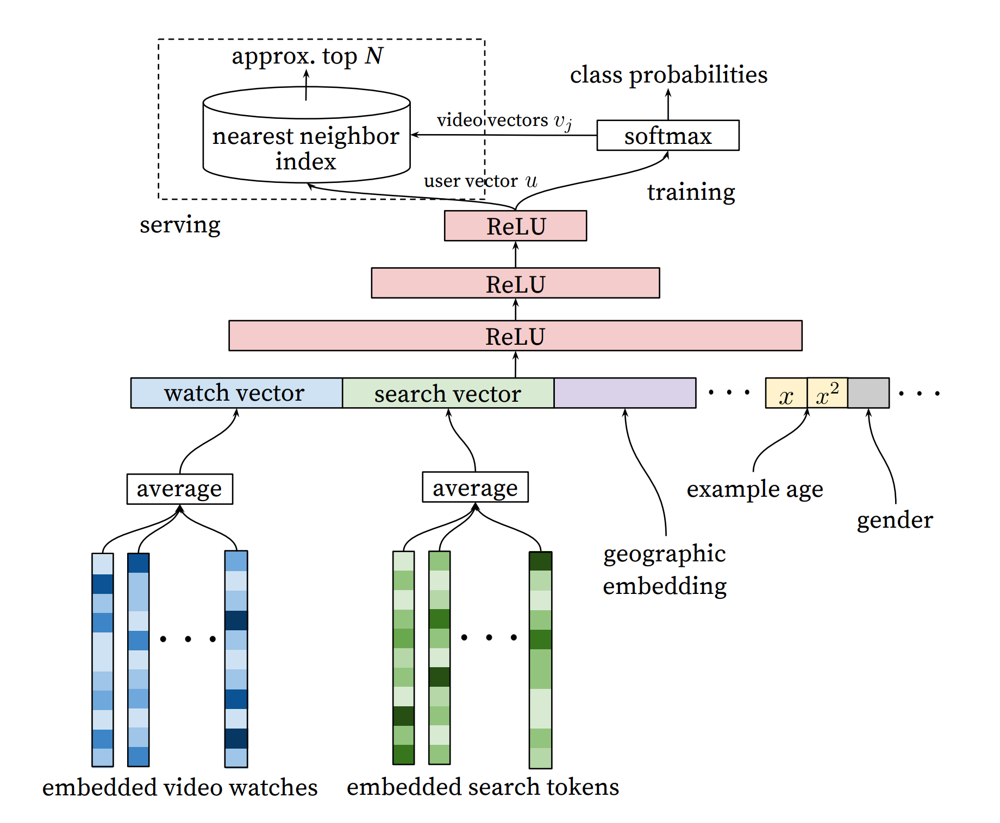
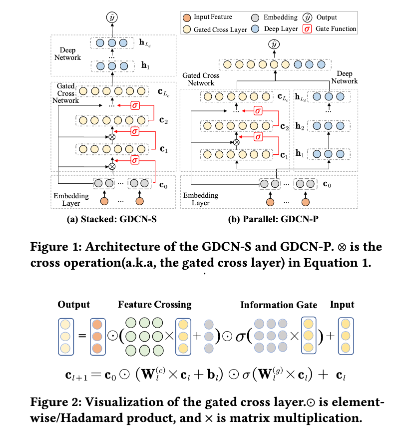

class: center, middle

# Recommender Systems &amp; Embeddings

Olivier Grisel

`olivier.grisel@inria.fr`

Adapted from [Charles Ollion and Olivier Grisel](https://github.com/m2dsupsdlclass/lectures-labs)

---
# Outline

### Embeddings

--

### Dropout Regularization

--

### Recommender Systems

---
class: middle, center

# Embeddings

---
# Symbolic variable

- Text: characters, words, bigrams...

- <span style="color:#cccccc">Recommender Systems: item ids, user ids</span>

- <span style="color:#cccccc">Any categorical descriptor: tags, movie genres, visited URLs, skills on a resume, product categories...</span>

---
# Symbolic variable

- Text: characters, words, bigrams...

- Recommender Systems: item ids, user ids

- <span style="color:#cccccc">Any categorical descriptor: tags, movie genres, visited URLs, skills on a resume, product categories...</span>

---
# Symbolic variable

- Text: characters, words, bigrams...

- Recommender Systems: item ids, user ids

- Any categorical descriptor: tags, movie genres, visited URLs, skills on a resume, product categories...

--

### Notation:

.center[
### Symbol $s$ in vocabulary $V$
]

---
# One-hot representation

$$onehot(\text{'salad'}) = [0, 0, 1, ..., 0] \in \\{0, 1\\}^{|V|}$$


.center[
          
]

--

<br/>

- Sparse, discrete, large dimension $|V|$
- Each axis has a meaning
- Symbols are equidistant from each other:

.center[euclidean distance = $\sqrt{2}$]

---
# Embedding

$$embedding(\text{'salad'}) = [3.28, -0.45, ... 7.11] \in \mathbb{R}^d$$

--

<br/>

- Continuous and dense
- Can represent a huge vocabulary in low dimension, typically: $d \in \\{16, 32, ..., 4096\\}$
- Axis have no meaning _a priori_
- Embedding metric can capture semantic distance

--

<br/>

**Neural Networks compute transformations on continuous vectors**

???
 _Yann Le Cun_ : "compute symbolic operations in algebraic space makes it possible to optimize via gradient descent"

---
# Implementation with Pytorch

Size of vocabulary $n = |V|$, size of embedding $d$

```py
>>> import torch
>>> n = 100_000
>>> d = 8
>>> embedding_layer = torch.nn.Embedding(num_embeddings=n, embedding_dim=d)
>>> token_ids = torch.IntTensor([0, 89432, 99_999])
>>> with torch.no_grad():
...     embedded_tokens = embedding_layer(token_ids)
...
>>> embedded_tokens.shape, embedded_tokens.dtype
(torch.Size([3, 8]), torch.float32)
>>> embedded_tokens
tensor([[ 1.0887, -1.1725, -0.8989,  1.2114,  0.1617,  0.5573,  0.3235,  0.5714],
        [ 1.0680, -0.9381, -0.4073, -0.9312, -1.2977,  1.6959,  1.2706, -0.4434],
        [ 0.1027, -0.6769,  0.7952, -0.1780,  1.4436,  0.0251,  1.1199,  0.6729]])
```

--
- Equivalent to one-hot encoding multiplied by a weight matrix $\mathbf{W} \in \mathbb{R}^{n \times d}$:

$$embedding\\_layer(token\\_ids) = onehot\\_layer(token\\_ids) . \mathbf{W}$$

--
- $\mathbf{W}$ is typically **randomly initialized**, then **tuned by backprop**
- $\mathbf{W}$ are trainable parameters of the model

---
# Distance and similarity in Embedding space

.left-column[
### Euclidean distance

$d(x,y) = || x - y ||_2$

- Simple with good properties
- Dependent on norm (embeddings usually unconstrained)
]

--

.right-column[
### Cosine similarity

$cosine(x,y) = \frac{x \cdot y}{||x|| \cdot ||y||}$

- Angle between points, regardless of norm
- $cosine(x,y) \in (-1,1)$
- Expected cosine similarity of random pairs of vectors is $0$

]

---
# Distance and similarity in Embedding space

If $x$ and $y$ both have unit norms:

$$|| x - y ||_2^2 = 2 \cdot (1 - cosine(x, y))$$

--
or alternatively:

$$cosine(x, y) = 1 - \frac{|| x - y ||_2^2}{2}$$

--

Alternatively, dot product (unnormalized) is used in practice as a pseudo similarity

---
# Visualizing Embeddings

- Visualizing requires a projection in 2 or 3 dimensions
- Objective: visualize which embedded symbols are similar

--

### PCA

- Limited by linear projection, embeddings usually have complex high dimensional structure

--

### t-SNE

<small>
  Visualizing data using t-SNE, L van der Maaten, G Hinton, _The Journal of Machine Learning Research_, 2008 <br/>
</small>


???
https://colah.github.io/posts/2014-10-Visualizing-MNIST/
---
# t-Distributed Stochastic Neighbor Embedding


 - Unsupervised, low-dimension, non-linear projection
 - Optimized to preserve relative distances between nearest neighbors
 - Global layout is not necessarily meaningful


--

### t-SNE projection is non deterministic (depends on initialization)
 - Critical parameter: perplexity, usually set to 20, 30
 - See http://distill.pub/2016/misread-tsne/

---
#Example word vectors

.center[
          <br/>
          <small>excerpt from work by J. Turian on a model trained by R. Collobert et al. 2008</small>
]

---
# Visualizing Mnist

.center[
          
]

---

class: middle, center

# Dropout Regularization

---

# Regularization

### Size of the embeddings

--

### Depth of the network

--

### $L_2$ penalty on embeddings

--

### Dropout

- Randomly set activations to $0$ with probability $p$
- Bernoulli mask sampled for a forward pass / backward pass pair
- Typically only enabled at training time

---
# Dropout

.center[
          
]

.footnote.small[Dropout: A Simple Way to Prevent Neural Networks from Overfitting,
Srivastava et al., _Journal of Machine Learning Research_ 2014]

---
# Dropout

### Interpretation

- Reduces the network dependency to individual neurons
- More redundant representation of data

### Ensemble interpretation

- Equivalent to training a large ensemble of shared-parameters, binary-masked models
- Each model is only trained on a single data point

---
#Dropout

.center[
          <br/>

]
          <br/>

At test time, multiply weights by $p$ to keep same level of activation

.footnote.small[Dropout: A Simple Way to Prevent Neural Networks from Overfitting,
Srivastava et al., _Journal of Machine Learning Research_ 2014]

---
# Overfitting Noise

.center[
          <br/>
]

???
This dataset has few samples and ~10% noisy labels.
The model is seriously overparametrized (3 wide hidden layers).
The training loss goes to zero while the validation stops decreasing
after a few epochs and starts increasing again: this is a serious case
of overfitting.

---
# A bit of Dropout

.center[
          <br/>
]

???
With dropout the training speed is much slower and the training loss
has many random bumps caused by the additional variance in the updates
of SGD with dropout.

The validation loss on the other hand stays closer to the training loss
and can reach a slightly lower level than the model without dropout:
overfitting is reduced but not completely solved.

---
# Too much: Underfitting

.center[
          <br/>
]

---
class: middle, center

# Recommender Systems

---
# Recommender Systems

### Recommend contents and products

Movies on Netflix and YouTube, weekly playlist and related Artists on
Spotify, books on Amazon, related apps on app stores,
"Who to Follow" on twitter...

--
### Prioritized social media status updates

--
### Personalized search engine results

--
### Personalized ads and RTB

---
# RecSys 101

### Content-based vs Collaborative Filtering (CF)

**Content-based**: user metadata (gender, age, location...) and
item metadata (year, genre, director, actors)

--

**Collaborative Filtering**: passed user/item interactions: stars, plays, likes, clicks

--

**Hybrid systems**: CF + metadata to mitigate the cold-start problem

---
# Explicit vs Implicit Feedback

**Explicit**: positive and negative feedback

- Examples: review stars and votes

- Regression metrics: Root Mean Squared Error (RMSE), Mean Absolute Error (MAE)...


--

**Implicit**: positive feedback only

- Examples: page views, plays, comments...

- Ranking metrics: ROC AUC, precision at rank, NDCG...

---
# Explicit vs Implicit Feedback

**Implicit** feedback much more **abundant** than explicit feedback

--

Explicit feedback does not always reflect **actual user behaviors**

- Self-declared independent movie enthusiast but watch a majority of blockblusters

--

**Implicit** feedback can be **negative**

- Page view with very short dwell time
- Click on "next" button

--

Implicit (and Explicit) feedback distribution **impacted by UI/UX changes**
and the **RecSys deployment** itself.

---
# Matrix Factorization for CF

.center[

]

$$
L(U, V) = \sum\_{(i, j) \in D} || r\_{i,j} - \mathbf{u}\_i^T \cdot \mathbf{v}\_j ||_2^2 + \lambda (||U||\_2^2 + ||V||\_2^2)
$$

- Train $U$ and $V$ on observed ratings data $r\_{i, j}$
- Use $U^T V$ to find missing entries in sparse rating data matrix $R$

---
class: center, middle

# Architecture and Regularization

---
# RecSys with Explicit Feedback

.center[

]

---
# Deep RecSys Architecture

.center[

]

---
# Deep RecSys with metadata

.center[

]

---
# Implicit Feedback: Triplet loss

.center[

]

---
# Deep Triplet Networks
.center[

]

---
# Training a Triplet Model

- Gather a set of positive pairs user $i$ and item $j$

- While model has not converged:

--
    - Shuffle the set of pairs $(i, j)$
--
    - For each $(i, j)$:
      - Sample item $k$ uniformly at random
--
      - Call item $k$ a negative item for user $i$
--
      - Train model on triplet $(i, j, k)$

???

This is called uniform negative sampling.

Note that new negative samples are collected for each pass
(epoch) over the positive feedback dataset.

It also possible to use the current state of the model to
"mine" hard negatives.

---
class: middle, center

# Some near-SOTA architectures

---
.center[


Deep Neural Networks for YouTube Recommendations
https://research.google.com/pubs/pub45530.html
]

???
Alternative way to deal with Implicit Feedback:

- no user embedding in input, the user is represented by averaged
  embeddings of movie watches (and queries)

- the output is a classification loss: 1 for the next movie being
  watched by the user.

---
.center[


Towards Deeper, Lighter and Interpretable Cross Network for CTR Prediction
https://arxiv.org/abs/2311.04635
]

---
class: middle, center

# Ethical Considerations of Recommender Systems

---
# Ethical Considerations

#### Amplification of existing discriminatory and unfair behaviors / bias

- Example: gender bias in ad clicks (fashion / jobs)
- Using the firstname as a predictive feature

--

#### Amplification of the filter bubble and opinion polarization

- Personalization can amplify "people only follow people they agree with"
- Optimizing for "engagement" promotes content that causes strong
  emotional reaction (and turns normal users into *haters*?)
- RecSys can exploit weaknesses of some users, lead to addiction
- Addicted users clicks over-represented in future training data

---
# Call to action

### Designing Ethical Recommender Systems

- Wise modeling choices (e.g. use of "firstname" as feature)
- Conduct internal audits to detect fairness issues: [SHAP](
  https://github.com/slundberg/shap), [Integrated Gradients](
    https://github.com/hiranumn/IntegratedGradients),
  [fairlearn.org](https://fairlearn.org/)
- Learning [representations that enforce fairness](
  https://arxiv.org/abs/1511.05897)?

--

### Transparency

- Educate decision makers and the general public
- How to allow users to assess fairness by themselves?
- How to allow for independent audits while respecting the privacy of users?

--

.center[
### Active Area of Research
]

???
# Fairness

Censoring Representations with an Adversary
Harrison Edwards, Amos Storkey, ICLR 2016
https://arxiv.org/abs/1511.05897

# Transparency

- http://www.datatransparencylab.org/
- TransAlgo initiative in France

---
class: middle, center

# That's all for today!
